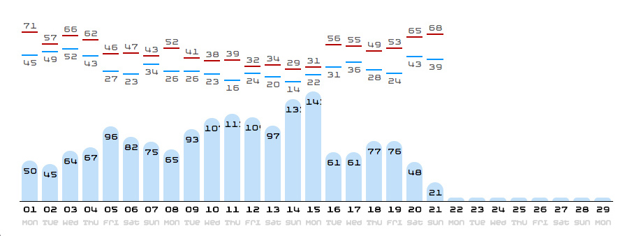

=====
Joule
=====

Description
===========

This is a simple Django project that estimates monthly electricity costs based
on real-time demand as broadcast via an Efergy_ transmitter.

Rationale
=========

The Efergy_ products are nice, but somewhat limiting on a number of fronts:

The Efergy monitor (stand alone unit)
-------------------------------------
- has at most 2 tariffs
- has limited memory
- limited (if any) export capabilities

The Efergy Hub Solo
-------------------
Nice product, but since it stores nothing locally, is subject to data-loss due
to network outages and interruptions. (Note to Efergy, this is huge and could
be remedied with a bit of store-and-forward.)

The Efergy Engage platform
--------------------------
This is actually a nice website that provides nice graphs of electricity
consumption. Unfortunately, due to the requirement of the Hub Solo for input,
the resulting data often contains outages due to network interruptions, etc.

Also, the site doesn't support any sort of tariff definition to tailor the
estimates to your electric provider's tariffs.

My Solution
-----------
To address these issues, I fitted a Raspberry Pi (Version 2 model B) with a
RTL-SDR dongle and a WiFi dongle. My cost was about $73, but that was about in
August, 2015 and I'd bet this could be created more more cheaply by now.

I created a service on the RaspPi leveraging RPI_Efergy_ that listens for and
captures the signal broadcast every 10 seconds by the Efergy transmitter. It
then converts this to the instantaneous power demand, and pushes it into
Django via a management command.

Django (1.8) logs this data into a MySQL database, and converts it (on demand)
into per minute averages.

The software here in this repo then takes over and serves up a webpage that
illustrates the power-demand in a couple of useful ways:

Summary
+++++++

At the top of the web-page, it displays an estimate of the current month's
usage and bill will be, based on data collected so far and the projecting it
forward into the rest of the month.

Daily
+++++

Next, it displays the consumption so far for each day of the month. Above
this is the high and low outside temperatures as collected from WUndergroud_.
This is useful for illustrating why consumption is high on certain days.

Hourly
++++++

Next is a display of the average consumption and cost per hour of the day.
This is displayed with bars to help spot consumption patterns. Bars to the
left are consumption, bars to the right are cost of that consumption based
on the active energy tariff.

Note that I'm displaying each hour by Weekends, Summer and Winter. This is
because my energy tariff is different depending on if the current day is a
weekend (or recognized holiday), or is during Piedmont's defined Winter or
Summer period. All three are shown, because some months contain records for
all three tariffs.

Notes
=====

This codebase isn't "ready to go". In addition to setting up your Raspberry Pi
with the required hardware and installing the Efergy transmitter, you'll need
to create your own class that represents your provider's tariff.

While I have tried to make this code as modular as possible, I did make it for
myself. Electricity tariffs can vary a lot in their design across the world,
but, I hope that I've designed the `Tariff` class flexible enough to be useful
to most.

My tariff is encapsulated into a `Piedmont` class, which can serve as an
example for others. Naturally, it is only one of several tariffs that the
`Piedmont Electric Membership Corporation`__ offers.

.. _RPI_Efergy: https://github.com/daveblackuk/RPI_Efergy
.. _Efergy: http://efergy.com/
.. _WUndergroud: https://www.wunderground.com/
.. _PEMC: http://pemc.coop/
__ PEMC_
